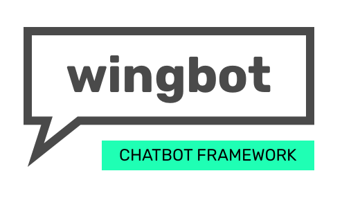

# Wingbot Chatbot Framework



[](https://circleci.com/gh/wingbotai/wingbot)

Framework for building reusable chatbot components. **Routing**, **Keyword recognition** is built-in.

- [**[API documentation](https://wingbotai.github.com/wingbot)**]

## Requirements and installation

  - requires `nodejs` > 6.0

  ```bash
  $ npm i -S wingbot
  ```

## Basic setup with Express

It's easy. This basic example can handle everything.

```javascript
const express = require('express');
const { Router } = require(''wingbot');
const mongoose = require('mongoose');
const { createRouter, createProcessor } = require(''wingbot/express');

const bot = new Router();

bot.use('/hello', (req, res, postBack) => {
    res.text('Hello world');
});

bot.use((req, res, postBack) => {
    res.text('What you want?', {
        hello: 'Say hello world'
    });
});

const processor = createProcessor(bot, {
    pageToken: 'pagetokenhere',
    appSecret: 'botappsecret',
    autoTyping: true
});

const app = express();

app.use('/bot', createRouter(processor, 'verifyTokenHere'));

mongoose.connect('mongodb://localhost/myapp')
    .then(() => app.listen(3000));
```